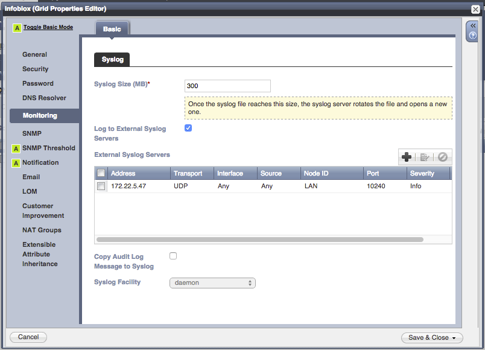
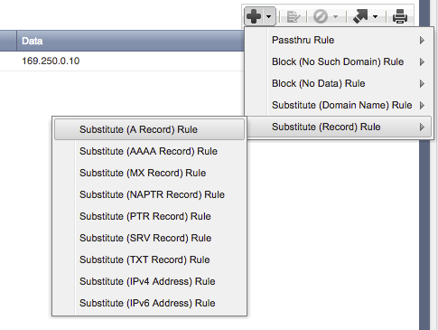

# Carbon Black - Infoblox Secure DNS Connector

## Installation Quickstart

The Carbon Black Infoblox Secure DNS Connector supports two different styles of integration:
1. on-prem Infoblox Appliances
2. Infoblox Active Trust Cloud  

There are two supported configurations for this connector:

1. Installing on the local Carbon Black server
2. Installing on a server other than your Carbon Black server

As root on the server you'd like to install the Infoblox connector, run the following:
```
cd /etc/yum.repos.d
curl -O https://opensource.carbonblack.com/release/x86_64/CbOpenSource.repo
yum install python-cb-infoblox-connector
```

Once the software is installed via YUM, then copy the `/etc/cb/integrations/infoblox/infoblox.conf.example` 
file to `/etc/cb/integrations/infoblox/infoblox.conf`. Edit this configuration file according to 
the [Configuration](#configuration) section below. Also check the [Configuration](#configuration) section for
more information on configuring the Infoblox appliance to forward alerts to this connector.

Once the configuration is in place, start the integration by starting the service. It is set to automatically start
on server startup.

```
service cb-infoblox-connector start
```

Any errors will be logged into `/var/log/cb/integrations/cb-infoblox-connector/cb-infoblox-connector.log`.

## Introduction

The Carbon Black Infoblox Secure DNS connector
ingests reports via syslog from the Infoblox Secure DNS appliance or via REST against Infoblox Cloud Services and correlates them against data in the connected
Carbon Black server. The connector can then take one or more actions based on these reports, including killing the offending process from the endpoint, isolating
the system from the network, and creating an alert for future followup.

Infoblox events are sent to the connector, which can either run on its own host or on the Carbon Black server
itself. The connector then correlates the DNS information with Carbon Black to determine what process caused the
DNS lookup. This correlation can only occur if the endpoint has *attempted to establish a TCP or UDP connection with
another host*. A Carbon Black network connection event is only generated when a TCP SYN or UDP packet is sent to
a target host, and these network connection events are used to correlate the DNS request against the Carbon Black
data.

Because of this limitation, **all DNS records in Infoblox that you want to correlate via this connector must have an associated A record** (in other words, if Infoblox returns NXDOMAIN, Carbon Black does not receive a netconn event
and this connector cannot correlate the activity against a running process on the endpoint). The IP does not have to
correspond to a real host; a network connection event will be generated as long as the host attempts to contact the
target IP, even if it doesn't exist or is unreachable.

*Note: This is a COMMUNITY SUPPORTED add-on. Please see the end for support options.*

## Requirements

This Carbon Black Infoblox Secure DNS Connector has the following requirements:
* *Carbon Black Enterprise Server 5.0 (or greater)* - this integration leverages API calls and feed functionality available in Carbon Black 5.0 and newer.  In order to check the version, you can run the following rpm command on your server: 

```
[root@localhost ~]# rpm -qa | grep cb-enterprise
cb-enterprise-5.0.0.150122.1654-1.el6.x86_64
```
* *Live Response* must be enabled on the Carbon Black server, and endpoints running a Carbon Black sensor version 5.0 or
greater, to take advantage of the Isolation and Process Termination features of this connector.
### On Prem  
* *Infoblox Secure DNS Appliance* - A set of DNS Response Policy Zones (RPZ) should be configured in the Infoblox appliance
### Infoblox Active Trust Cloud
* *Infoblox Cloud Services* - If using the Infoblox Active Trust Cloud, configure network, public IP and appropriate policies. 

## Configuration

Both the Connector and Infoblox have to be configured to talk to each other. The specifics vary depending on if an onprem
appliance is used or if the Infoblox Cloud is utilized. See the following two configuration sections, respectively.

### Infoblox Appliance Configuration (ONPREM)
1. Log into the Infoblox console
2. Click on the Grid tab on top, and then under the Edit dropdown on the right side of the screen, click *Grid Properties*.

    

3. Configure the Syslog server property to point to the server running the Infoblox connector by clicking the 
*Monitoring* tab on the left side of the dialog box, and adding an entry in the *External Syslog Servers* box.

    

4. Press the Save & Close button.
5. Ensure that all DNS zones use Substitute A records (instead of NXDOMAIN) for their response type. 
*See the [Introduction](#introduction) above for more information on why A records are required for the Infoblox connector
to correlate Carbon Black network connection events with the DNS events received from Infoblox.*

    
    
### Infoblox Cloud Configuration:
http://help.csp.infoblox.com/infoblox-activetrustcloud-home/

This example shows how to configure the infoblox cloud services to report on dns events made by certain public IPs/ranges.
(Consult the infoblox support documentation for more advanced configurations)
1. Log into csp.infoblox.com
2. Go to Manage -> networks
3. add a new network 'public IPs' and associate the IP/s ranges you want to monitor  
4. DNS events against the configured network will be reported by the Infoblox Active Trust Cloud.  
 
    
### Connector Configuration

You'll need to place a configuration file in the following location: `/etc/cb/integrations/infoblox/infoblox.conf`

A sample file is provided in `/etc/cb/integrations/infoblox/infoblox.conf.example`, so you can rename the file with the following command: 

```
mv /etc/cb/integrations/infoblox/infoblox.conf.example /etc/cb/integrations/infoblox/infoblox.conf
```

Inside the configuration file, under the `[bridge]` section, are the following fields:
* **use_cloud_api** : The Infoblox connector for Cbr can either connect to an on-premis Infoblox Appliance (default) or to the Infloblox Active Trust Cloud. 
    * This setting defaults to false which means an on premis appliance will be used by default - change to true to toggle cloud api support

* **Feed Server**: The Infoblox connector publishes a feed to Carbon Black. These configuration options
define how the Carbon Black server will reach the Infoblox feed that this connector publishes.
    * `listener_address` : Set to the IPv4 address of the interface the feed web server should listen on. The default is `0.0.0.0`,
    or all configured IPv4 interfaces at the time the service starts.
    * `listener_port` : Set to the port number that the feed server will listen on. There is no default, and it must be
    defined for the service to start.
    * `feed_host` : Set to the IPv4 address that the Cb server can reach the machine hosting this connector. 
    If this connector is installed on the Cb server itself, this should be set to `127.0.0.1`. The default is `127.0.0.1`.

* **Infoblox Integration**: These configuration options define parameters associated with the Infoblox appliance
    * `infoblox_server_address` : Set to the IPv4 address of the Infoblox Secure DNS appliance. There is no default,
    and it must be defined for the service to start.

* **Carbon Black**: These configuration options define the parameters associated with the Carbon Black server. The
configuration options in this section are all required before the service will start.
    * `carbonblack_server_url` : Set to the URL for your Carbon Black server (example https://cbserver).
    * `carbonblack_server_token` : Set to the API token for your Carbon Black server.
    * `carbonblack_server_sslverify` : Set to "0" if your Carbon Black server has a self-signed SSL certificate.

* **Actions**: These configuration options define what actions the connector will take upon receiving an alert
from Infoblox. More information on these actions is available in the [Actions](#actions) section below.
    * `do_kill` : Kill any process that connects to a domain blacklisted by the Infoblox Secure DNS appliance.
    Set to "false", "streaming", or "api". Default is "false". See [Kill process](#kill-process) for details.
    * `do_isolation` : Isolate any host that contacts a domain backlisted by the Infoblox Secure DNS appliance.
    Set to "false" or "true". Default is "false". *Note that the isolation has no timeout; it will remain isolated until manually removed from isolation.*
    * `do_alert` : When enabled, a Cb alert will be created
 for every process that contacts a domain flagged by Infoblox.

    Set to "false" or "true". Default is "false".

* **Carbon Black - Streaming**: These configuration options are required if the "streaming" action is enabled above.
    * `carbonblack_streaming_host` : Set to the IP/DNS name of the Cb server

    * `carbonblack_streaming_username` : Set to `RabbitMQUser` from `/etc/cb/cb.conf`
    * `carbonblack_streaming_password` : Set to `RabbitMQPassword` from `/etc/cb/cb.conf

`

* **Infoblox Cloud API**: These configuration options are required if the 'use_cloud_api' configuration option has been enabled 
    * `api_route` : Set to the api route for DNS events from infoblox: "https://csp.infoblox.com/api/threats/v1/dns_event"
    * `api_token` : Set to the authentication token from Infoblox ATC
    * `rest_poll_interval` : controls polling frequency defaults to 5 minutes
    
## Actions

The Infoblox connector will take a configurable set of actions based on each DNS alert received from Infoblox.
This section describes each action and how it works.

### Kill Process

This action is configured via the `do_kill` option in the configuration file. This action requires that the Carbon Black
server is configured to enable Live Response (see `CbLREnabled` in `/etc/cb/cb.conf`). 
There are two methods for tracking processes to terminate via the Infoblox connector: through the REST API and through
the Carbon Black streaming interface.

The REST API requires the least configuration, but is implemented by periodically polling the Carbon Black server
for processes that match the domain and sensor associated with the Infoblox event. This is 
subject to a potentially significant delay (up to 15 minutes) before the process is available for searching in the REST API.
Once the domain is flagged by Infoblox for a specific endpoint, any processes on that endpoint that contact that domain will
automatically be killed. This method is enabled by setting the configuration option `do_kill` to `api`.

The streaming interface requires more configuration, but allows Carbon Black to push the process data to the connector
rather than continually polling for activity. This interface is not subject to the REST API commit delay, and so 
processes can be flagged and terminated much quicker through the streaming interface. This method requires the RabbitMQ
streaming interface to be enabled in the Carbon Black server (see the `DatastoreBroadcastEventTypes` and `RabbitMQ`
options in `/etc/cb/cb.conf`). This method is enabled by
setting the configuration option `do_kill` to `streaming` and setting the appropriate `carbonblack_streaming_*` options
in the configuration file.

### Isolate Endpoint

This action is configured via the `do_isolate` option in the configuration file. This action requires that the Carbon Black
server is configured to enable Live Response (see `CbLREnabled` in `/etc/cb/cb.conf`). 

Once enabled, this action will isolate any endpoint that attempts to contact a domain blacklisted by the Infoblox
appliance. The isolation will remain in effect until the sensor is removed from isolation manually.

### Create Carbon Black Alert

This action is configured via the `do_alert` option in the configuration file. This action ensures that the Infoblox
feed created on the Carbon Black server has the "alert" notification turned on, which will create an alert in the 
Carbon Black console for every process that contacts a domain blacklisted by the Infoblox appliance.

## Execution

This integration is executed via a service script that is set to start upon system boot. The service is not started
immediately after installation, so that it can be configured before the first launch. After creating the configuration
according to the [Configuration](#configuration) section above, then start the service manually:

```
service cb-infoblox-connector start
```

If there are any problems, see [Troubleshooting](#troubleshooting) below for the location of the log file.

## Troubleshooting

If you suspect a problem, please first look at the connector logs found here: `/var/log/cb/integrations/cb-infoblox-connector/cb-infoblox-connector.log`

(There might be multiple files as the logger "rolls over" when the log file hits a certain size).

## Contacting Bit9 Developer Relations Support

Web: https://community.bit9.com/groups/developer-relations
E-mail: dev-support@bit9.com

### Reporting Problems

When you contact Bit9 Developer Relations Technical Support with an issue, please provide the following:

* Your name, company name, telephone number, and e-mail address
* Product name/version, CB Server version, CB Sensor version
* Hardware configuration of the Carbon Black Server or computer (processor, memory, and RAM) 
* For documentation issues, specify the version of the manual you are using. 
* Action causing the problem, error message returned, and event log output (as appropriate) 
* Problem severity
