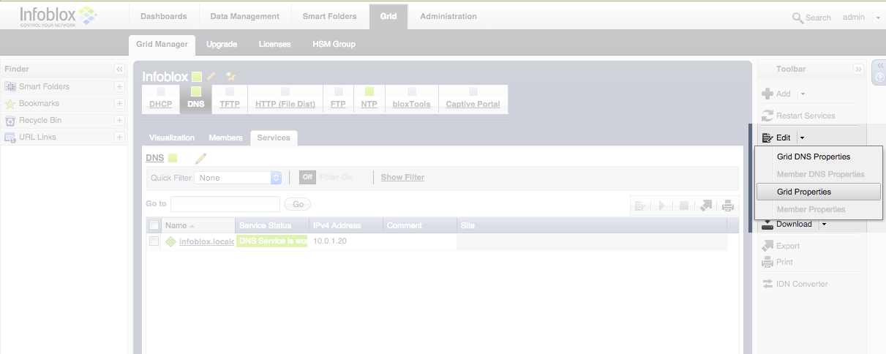

# Carbon Black - Infoblox Secure DNS Connector

## Installation Quickstart

There are two supported configurations for this connector:
1. Installing on the local Carbon Black server
2. Installing on a server other than your Carbon Black server

As root on the server you'd like to install the Infoblox connector, run the following:
```
cd /etc/yum.repos.d
curl -O https://opensource.carbonblack.com/release/x86_64/CbOpenSource.repo
yum install python-cb-infoblox-connector
```

Once the software is installed via YUM, then copy the `/etc/cb/integrations/infoblox/infoblox.conf.example` 
file to `/etc/cb/integrations/infoblox/infoblox.conf`. Edit this configuration file according to 
the [Configuration](#configuration) section below. Also check the [Configuration](#configuration) section for
more information on configuring the Infoblox appliance to forward alerts to this connector.

Once the configuration is in place, start the integration by starting the service. It is set to automatically start
on server startup.

```
service cb-infoblox-connector start
```

Any errors will be logged into `/var/log/cb/integrations/infoblox/infoblox.log`.

## Introduction

This document describes how to install and use the Carbon Black Infoblox Secure DNS Connector. This connector
ingests reports from the Infoblox Secure DNS appliance and forwards them to the Carbon Black server. This connector
can also take action based on these reports, including killing the offending process from the endpoint, isolating
the system from the network, and creating an alert for future followup.

*Note: This is a COMMUNITY SUPPORTED add-on. Please see the end for support options.*

## Requirements

This Carbon Black Infoblox Secure DNS Connector has the following requirements:
* *Carbon Black Enterprise Server 5.0 (or greater)* - this integration leverages API calls and feed functionality available in Carbon Black 5.0 and newer.  In order to check the version, you can run the following rpm command on your server: 

```
[root@localhost ~]# rpm -qa | grep cb-enterprise
cb-enterprise-5.0.0.150122.1654-1.el6.x86_64
```

* *Infoblox Secure DNS Appliance* - A set of DNS Response Policy Zones (RPZ) should be configured in the Infoblox appliance
representing the feed of DNS names to alert upon.

## Configuration

Both the Connector and Infoblox have to be configured to talk to each other.

### Infoblox Configuration

1. Log into the Infoblox console
2. Click on the Grid tab on top, and then under the Edit dropdown on the right side of the screen, click *Grid Properties*.
(See picture below)

3. Configure the Syslog server property to point to the server running the Infoblox connector. 

4. Press OK.
5. Ensure that all DNS zones use Substitute A records (instead of NXDOMAIN) for their response type. (See picture below)


### Connector Configuration

You'll need to place a configuration file in the following location: `/etc/cb/integrations/infoblox/infoblox.conf`

A sample file is provided in `/etc/cb/integrations/infoblox/infoblox.conf.example`, so you can rename the file with the following command: 

```
mv /etc/cb/integrations/infoblox/infoblox.conf.example /etc/cb/integrations/infoblox/infoblox.conf
```

Inside the configuration file, under the `[bridge]` section, are the following fields:

* **Feed Server**: These configuration options define parameters for the built in Feed HTTP server and how the Carbon 
Black server will reach the Infoblox feed that this connector publishes.
    * `listener_address` : Set to the IPv4 address of the interface the feed server should listen on. The default is `0.0.0.0`,
    or all configured IPv4 interfaces at the time the service starts.
    * `listener_port` : Set to the port number that the feed server will listen on. There is no default, and it must be
    defined for the service to start.
    * `feed_host` : Set to the IPv4 address that the Cb server can reach the feed server. If this connector is installed
     on the Cb server itself, this should be set to `127.0.0.1`. The default is `127.0.0.1`.

* **Infoblox Integration**: These configuration options define parameters associated with the Infoblox appliance
    * `infoblox_server_address` : Set to the IPv4 address of the Infoblox Secure DNS appliance. There is no default,
    and it must be defined for the service to start.

* **Carbon Black**: These configuration options define the parameters associated with the Carbon Black server. The
configuration options in this section are all required before the service will start.
    * `carbonblack_server_url` : Set to the URL for your Carbon Black server (example https://cbserver).
    * `carbonblack_server_token` : Set to the API token for your Carbon Black server.
    * `carbonblack_server_sslverify` : Set to "0" if your Carbon Black server has a self-signed SSL certificate.

* **Actions**: These configuration options define what actions the connector will take upon receiving an alert
from Infoblox.
    * `do_kill` : Kill any process that connects to a domain blacklisted by the Infoblox Secure DNS appliance.
    Set to "false", "streaming", or "api". Default is "false".
    "streaming" will use the RabbitMQ bus to listen for process starts. 
    "streaming" will provide the most
 immediate response capability; you will need to enable the RabbitMQ bus in
    Carbon Black and set the options below in *Carbon Black - Streaming*.
    "api" will use the Cb REST API to query for processes. 
    This is subject to the delay getting process
 data into the Cb SOLR database - which can be up to 15 minutes.

    * `do_isolation` : Isolate any host that contacts a domain backlisted by the Infoblox Secure DNS appliance.
    Set to "false" or "true". Default is "false". *Note that the isolation has no timeout; it will remain isolated until manually removed from isolation.*
    * `do_alert` : When enabled, a Cb alert will be created
 for every process that contacts a domain flagged by Infoblox.

    Set to "false" or "true". Default is "false".

* **Carbon Black - Streaming**: These configuration options are required if the "streaming" action is enabled above.
    * `carbonblack_streaming_host` : Set to the IP/DNS name of the Cb server

    * `carbonblack_streaming_username` : Set to `RabbitMQUser` from `/etc/cb/cb.conf`
    * `carbonblack_streaming_password` : Set to `RabbitMQPassword` from `/etc/cb/cb.conf

`
    
## Execution

This integration is executed via a service script that is set to start upon system boot. The service is not started
immediately after installation, so that it can be configured before the first launch. After creating the configuration
according to the [Configuration](#configuration) section above, then start the service manually:

```
service cb-infoblox-connector start
```

If there are any problems, see [Troubleshooting](#troubleshooting) below for the location of the log file.

## Troubleshooting

If you suspect a problem, please first look at the connector logs found here: `/var/log/cb/integrations/infoblox/infoblox.log`

(There might be multiple files as the logger "rolls over" when the log file hits a certain size).

## Contacting Bit9 Developer Relations Support

Web: https://community.bit9.com/groups/developer-relations
E-mail: dev-support@bit9.com

### Reporting Problems

When you contact Bit9 Developer Relations Technical Support with an issue, please provide the following:

* Your name, company name, telephone number, and e-mail address
* Product name/version, CB Server version, CB Sensor version
* Hardware configuration of the Carbon Black Server or computer (processor, memory, and RAM) 
* For documentation issues, specify the version of the manual you are using. 
* Action causing the problem, error message returned, and event log output (as appropriate) 
* Problem severity
